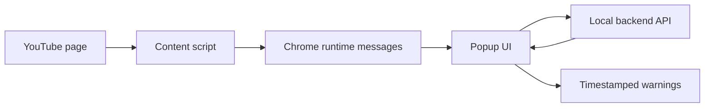

# TruthExtension

TruthExtension is an exploratory Chrome extension prototype for surfacing fact-checking context while watching YouTube videos.

The extension reads the current video title and playback timestamp, opens a popup UI, and can display timestamped claims or warnings returned by a local backend API.

## Architecture



## What Is Implemented

- Content script detects the YouTube video title.
- Popup stores and displays the active title.
- Content script streams playback time to the popup.
- Popup can mark a timestamp with a reason.
- Popup includes a local API integration point for fact-check/error retrieval.
- Demo claim data is returned when the backend path is not wired up.

## Setup

Install dependencies:

```bash
npm install
```

Build the popup bundle:

```bash
npm run build
```

For local development with rebuild-on-change:

```bash
npm run watch
```

Then load the repository folder as an unpacked Chrome extension.

## Backend Assumption

The prototype currently assumes a local backend at:

```text
http://127.0.0.1:8000
```

The extension calls:

- `GET /api/errors`
- `POST /input/`

Those endpoints are placeholders for the fact-checking backend. The extension is not production-ready until those contracts are documented and authenticated.

## Limitations

- Demo data is hardcoded in the popup path.
- Backend URL is hardcoded for local development.
- No production authentication or privacy review is included.
- This should be presented as a prototype, not as a finished misinformation detection product.

Interested in this area? Email me at praneeth.suresh.s@gmail.com.
